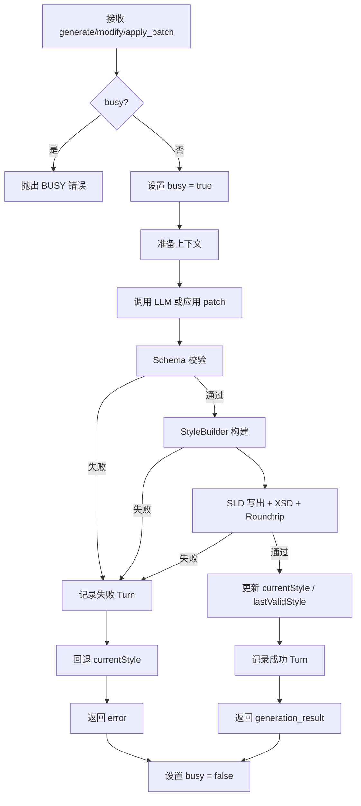
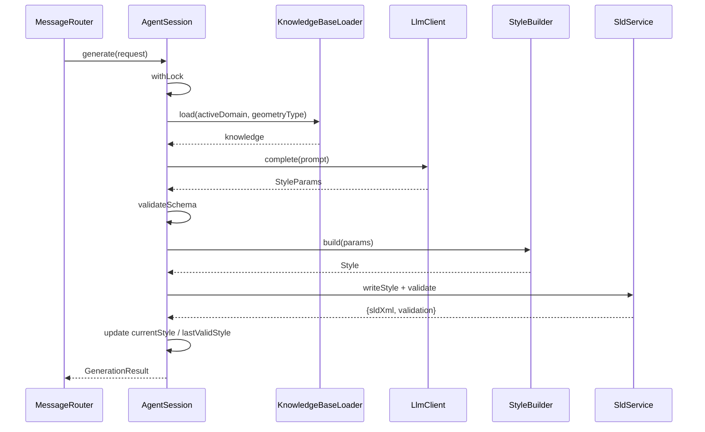

# AgentSession 设计

> 文档定位：后端核心状态容器，负责维护当前权威 Style、多轮对话上下文、校验与回退。  
> 配套契约：[interface-contracts.md](interface-contracts.md)

---

## 1. 职责

- 持有当前权威的 `GeoStyler Style` 状态。
- 保存最近一次**校验通过**的 Style 快照，用于失败回退。
- 接收 `generate` / `modify` / `apply_patch` / `import_style` 请求，协调 KnowledgeBase、LlmClient、StyleBuilder、SldService 完成处理。
- 维护聊天历史文本（仅文本，不暴露参数快照给用户）。
- 防止并发修改：同一 Session 同时只能执行一个生成/修改任务。

---

## 2. 核心状态

```typescript
class AgentSession {
  /** 会话唯一标识 */
  id: string;

  /** 当前激活的业务领域，默认 'default' */
  activeDomain: string;

  /** 用户传入的数据 schema，用于属性驱动样式 */
  dataSchema?: DataSchema;

  /** 当前权威 GeoStyler Style */
  currentStyle?: Style;

  /** 最近一次校验通过的 Style 快照 */
  lastValidStyle?: Style;

  /** 最近一次校验通过的 SLD XML */
  lastValidSldXml?: string;

  /** 聊天历史（纯文本，用于 UI 展示） */
  chatHistory: ChatMessage[];

  /** 内部 turn 记录，用于调试与审计，不暴露给用户 */
  turns: Turn[];

  /** 是否正在处理生成/修改任务 */
  private busy: boolean;
}
```

```typescript
interface ChatMessage {
  role: 'user' | 'assistant';
  content: string;
  timestamp: number;
}

interface Turn {
  /** 本轮用户指令 */
  instruction: string;
  /** LLM 解析出的结构化参数 */
  params?: StyleParams;
  /** 生成结果快照 */
  result?: StyleSnapshot;
  /** 是否成功 */
  success: boolean;
  /** 错误信息（失败时） */
  error?: string;
  timestamp: number;
}

interface StyleSnapshot {
  style: Style;
  sldXml: string;
  params?: StyleParams;
  validation: ValidationReport;
  explanation: string;
  timestamp: number;
}
```

---

## 3. 核心方法

```typescript
class AgentSession {
  /**
   * 自然语言生成新样式。
   * 流程：loadKnowledge → buildPrompt → callLLM → validateSchema → buildStyle → validateSld。
   */
  async generate(request: GenerateRequest): Promise<GenerationResult>;

  /**
   * 多轮增量修改。
   * 流程与 generate 类似，但基于 currentStyle 做增量合并，并注入 modification_rules。
   */
  async modify(request: ModifyRequest): Promise<GenerationResult>;

  /**
   * 应用 UI 提交的 patch。
   * 这是**参数化精修**的主路径：用户通过前端表单、分类表格、Filter 编辑器等
   * 结构化界面直接修改样式参数，不经过 LLM 语义解析，因此精度最高。
   * 流程：applyPatches → buildStyle（如需补全） → validateSld。
   */
  async applyPatch(request: ApplyPatchRequest): Promise<GenerationResult>;

  /**
   * 导入已有 GeoStyler Style。
   */
  async importStyle(request: ImportStyleRequest): Promise<GenerationResult>;

  /**
   * 导出 SLD XML。
   */
  async export(request: ExportRequest): Promise<ExportResult>;

  /**
   * 主动校验当前 Style 或传入的 Style。
   */
  async validate(style?: Style): Promise<ValidationReport>;

  /**
   * 切换当前领域，重新加载知识库。
   */
  setDomain(domainId: string): void;

  /**
   * 设置数据 schema，供 RuleGenerator 与 LLM 上下文使用。
   */
  setDataSchema(schema: DataSchema): void;

  /**
   * 回退到 lastValidStyle。
   */
  rollback(): void;
}
```

---

## 3.5 知识库加载与 Prompt 构建

`AgentSession` 在生成/修改前必须加载当前激活领域的知识库片段，作为 LLM 上下文的一部分。

### 3.5.1 知识库结构

```text
knowledge/
├── root.json        # 索引 default / transport / landuse
├── default.json     # 通用 point/line/polygon/text 规则
├── transport.json   # 交通领域
└── landuse.json     # 土地利用领域
```

- `default` 始终加载；业务领域文件按需加载。
- 每次只激活一个业务领域（如 `transport`、`landuse`）。
- 合并规则：对象字段业务领域覆盖 `default`，数组字段业务领域在前、`default` 在后。

> 来源：[spike/knowledge-base-prompt/result.md](../../../spike/knowledge-base-prompt/result.md)。

### 3.5.2 Prompt 组成

调用 LLM 时，prompt 至少包含：

1. **system 角色说明**：任务定义、输出格式要求（仅输出 JSON）。
2. **JSON Schema**：完整 `style-params.schema.json`，约束 LLM 输出结构。
3. **知识库片段**：`style_catalog`、`parameter_dictionary`、`constraints`、`few_shot_examples`、`modification_rules`。
4. **当前完整 `StyleParams`**：从 `currentStyle` 反推或保存最近一次成功的 `params`（SP-01 验证可 100% 保留字段）。
5. **用户本轮指令**。
6. **`preserve` 列表**：明确要求保留的字段。

### 3.5.3 别名归一化

LLM 可能输出语义别名（如 `font_color`、`font_name`）。在 schema 校验之后、`StyleBuilder` 之前，由 `ParamsNormalizer` 映射为标准字段：

| LLM 常用别名 | 标准字段 |
|---|---|
| `font_color` | `stroke_color` |
| `font_name` | `font_family` |

> 来源：[spike/llm-json-styleparams/result.md](../../../spike/llm-json-styleparams/result.md)。

---

## 4. 生成/修改统一流水线



---

## 5. 回退机制

### 5.1 何时回退

- LLM 输出 Schema 校验失败。
- StyleBuilder 无法构建合法 Style。
- SLD 写出失败。
- XSD 校验失败。
- Parser 双向校验失败。

### 5.2 如何回退

```typescript
private rollback(): void {
  if (this.lastValidStyle) {
    this.currentStyle = structuredClone(this.lastValidStyle);
  } else {
    this.currentStyle = undefined;
  }
}
```

### 5.3 不回退的场景

- `validate` 主动校验失败：仅返回报告，**不修改状态**。
- `export` 失败：不修改状态，返回错误。

### 5.4 无 `lastValidStyle` 时的行为

若当前没有任何成功状态（例如第一轮生成就失败），则 `currentStyle` 置为 `undefined`，前端展示空状态。

---

## 6. 多轮增量修改协议

### 6.1 上下文组成

后端调用 LLM 时，Prompt 中需包含：

1. 当前激活领域的知识库片段（`style_catalog`、`parameter_dictionary`、`constraints`、`few_shot_examples`、`modification_rules`）。详见 §3.5。
2. 当前完整的 `StyleParams`（从 `currentStyle` 反推或保存最近一次成功的 `params`），而不仅是摘要。
3. 用户本轮指令。
4. （可选）用户明确要求保留的字段列表 `preserve`。

> **Spike 验证**：仅提供精简摘要时，LLM 在多轮修改中容易丢失未提及字段；提供完整 `StyleParams` 后，字段保留正确率达到 100%。详见 [spike/llm-json-styleparams/result.md](../../../spike/llm-json-styleparams/result.md)。

### 6.2 参数摘要（仅用于展示）

为避免 Prompt 过长，可对完整 `StyleParams` 做适度压缩，但核心字段必须保留：

```typescript
function prepareModificationContext(current: StyleParams): string {
  // 保留所有字段，仅对 categories/rules 等长数组做截断提示
  return JSON.stringify(current, null, 2);
}
```

若未来 token 压力过大，再评估是否切换为精简摘要，并在摘要中显式列出所有字段名以提示 LLM 保留。

### 6.3 增量合并策略

```typescript
function mergeParams(
  current: StyleParams,
  llmOutput: StyleParams,
  preserve: string[],
  normalizer: ParamsNormalizer
): StyleParams {
  // 1. 归一化 LLM 可能发明的语义别名（如 font_color -> stroke_color）
  const normalized = normalizer.normalize(llmOutput);

  // 2. LLM 输出覆盖旧值，但被 preserve 的字段强制保留
  const merged = { ...current, ...normalized };
  for (const field of preserve) {
    if (field in current) {
      merged[field] = current[field];
    }
  }
  return merged;
}
```

### 6.4 默认 preserve 规则

若用户未指定 `preserve`，默认保留：

- `geometry_type`
- `style_type`
- `field_name`（如果存在）

> 后端实际合并前，会先把 `current` 中的完整 `StyleParams` 注入 prompt，因此 LLM 通常也会自觉保留这些字段；`preserve` 作为强制兜底。

### 6.5 自然语言修改 vs 参数化精修

SLDAgent 提供两条修改路径，分工如下：

| 路径 | 适用场景 | 精度 | 典型用法 |
|---|---|---|---|
| `modify`（自然语言） | 语义级调整，如“整体色调偏冷”“让道路更像高速公路” | 高，但存在语义歧义 | 生成初稿后的风格调整 |
| `apply_patch`（参数化精修） | 具体数值/结构修改，如颜色、线宽、Filter 条件 | 精确 | 前端参数面板、分类表格、Filter 编辑器 |

MVP 采用**确认后提交**模式：用户在前端编辑器中完成一组修改后点击“应用”，前端批量发送 `patches`，后端原子性应用并校验。该模式避免每改一个字段就触发一次 WS 与校验，同时保证状态一致性。

## 7. 并发控制

```typescript
private async withLock<T>(fn: () => Promise<T>): Promise<T> {
  if (this.busy) {
    throw new SldAgentError(ErrorCode.INVALID_REQUEST, 'Session is busy', { busy: true });
  }
  this.busy = true;
  try {
    return await fn();
  } finally {
    this.busy = false;
  }
}
```

- `generate`、`modify`、`apply_patch`、`import_style` 必须通过 `withLock` 执行。
- `validate`、`export`、`get_domains`、`set_domain` 不修改状态，可并发执行。

---

## 8. 聊天历史与 Turn 记录

### 8.1 聊天历史（面向用户）

```typescript
interface ChatMessage {
  role: 'user' | 'assistant';
  content: string;
  timestamp: number;
}
```

- 用户指令原样存入。
- Assistant 消息为 `explanation` 字段内容，必要时加上校验结果摘要（如“已生成并通过 XSD 校验”）。

### 8.2 Turn 记录（内部审计）

```typescript
interface Turn {
  instruction: string;
  params?: StyleParams;
  result?: StyleSnapshot;
  success: boolean;
  error?: string;
  timestamp: number;
}
```

- `Turn` 不返回给前端，仅用于日志、调试、后续问题定位。
- 符合 [requirements.md](requirements.md)“不维护参数变更历史”的约束：用户界面不展示历史快照，系统内部仅保留最后一次有效状态。

---

## 9. 初始化与默认状态

```typescript
function createSession(id: string): AgentSession {
  return new AgentSession({
    id,
    activeDomain: 'default',
    chatHistory: [],
    turns: [],
    currentStyle: undefined,
    lastValidStyle: undefined,
    busy: false,
  });
}
```

---

## 10. 与 MessageRouter 的交互



---

## 11. 错误处理策略

| 阶段 | 错误类型 | 行为 |
|---|---|---|
| 请求解析 | `INVALID_REQUEST` | 直接返回错误，不修改状态 |
| 并发冲突 | `INVALID_REQUEST` (busy) | 直接返回错误 |
| LLM 调用 | `LLM_ERROR` | 回退，返回错误 |
| Schema 校验 | `SCHEMA_VALIDATION_FAILED` | 回退，返回错误 |
| StyleBuilder | `BUILDER_ERROR` | 回退，返回错误 |
| SLD 写出 | `SLD_PARSE_ERROR` | 回退，返回错误 |
| XSD 校验 | `XSD_VALIDATION_FAILED` | 回退，返回错误 |
| Roundtrip | `ROUNDTRIP_VALIDATION_FAILED` | 回退，返回错误 |

---

## 12. 待细化点

- 当前 modify 流程已采用完整 `StyleParams` 注入 prompt。若后续遇到 token 限制，再评估是否切换为精简摘要，并在摘要中显式列出所有字段名以提示 LLM 保留。
- `preserve` 列表是否支持通配或前缀匹配（如 `stroke_*`）。
- 是否需要 Session 持久化（重启后恢复当前 Style），MVP 建议不持久化。
