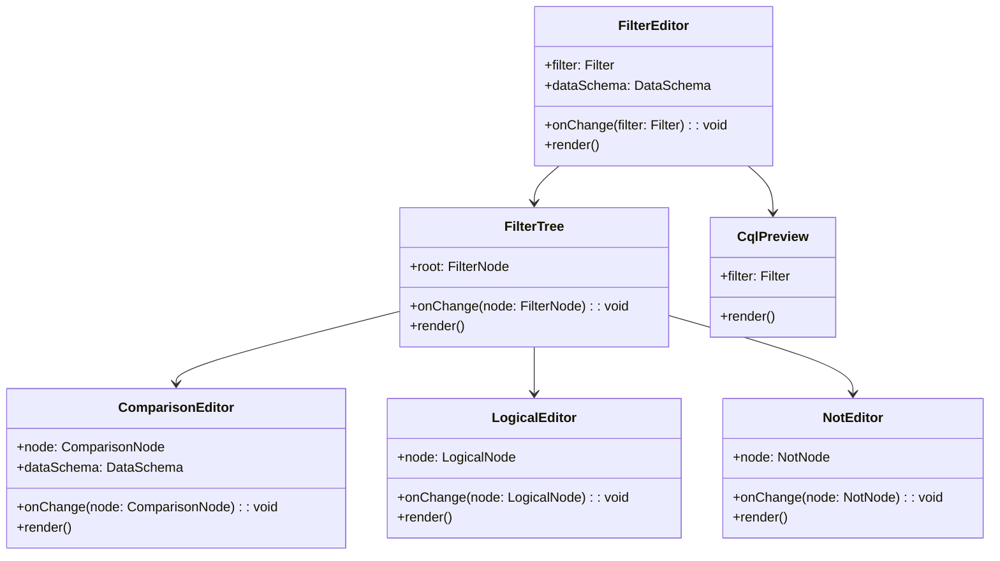

# Filter 编辑器设计

> 文档定位：Rule 过滤条件的可视化构造器与 GeoStyler Filter 数组之间的中间表示。  
> 配套契约：[interface-contracts.md](interface-contracts.md)、[style-builder.md](style-builder.md)

---

## 1. 职责

- 为 Rule 提供可视化过滤条件构造器。
- 中间表示采用 **GeoStyler Filter 数组**（如 `['==', 'landuse', 'residential']`）。
- 支持 AND / OR / NOT 逻辑组合。
- 提供 **只读 CQL 预览**，帮助用户理解当前过滤条件。
- 支持字段类型校验（字符串需引号、数值不需引号等）。

---

## 2. 数据模型

### 2.1 GeoStyler Filter 数组规范

GeoStyler 使用前缀表达式数组表示 Filter：

```typescript
type Filter =
  | ComparisonFilter
  | LogicalFilter
  | NotFilter
  | null;

type ComparisonOperator =
  | '==' | '!=' | '<' | '<=' | '>' | '>='
  | 'like' | 'ilike'
  | 'between'
  | 'in';

type ComparisonFilter =
  | [ComparisonOperator, string, string | number | boolean]
  | ['between', string, number, number]
  | ['in', string, (string | number | boolean)[]];

type LogicalOperator = '&&' | '||';
type LogicalFilter = [LogicalOperator, ...Filter[]];
type NotFilter = ['!', Filter];
```

示例：

```json
["==", "landuse", "residential"]

["&&",
  ["==", "type", "highway"],
  [">", "population", 10000]
]

["!", ["==", "status", "deleted"]]
```

### 2.2 UI 树模型

前端使用树形节点表示 Filter，便于递归渲染：

```typescript
interface FilterNodeBase {
  id: string;
  type: 'comparison' | 'logical' | 'not';
}

interface ComparisonNode extends FilterNodeBase {
  type: 'comparison';
  operator: ComparisonOperator;
  property: string;
  value: string | number | boolean | string[] | number[];
}

interface LogicalNode extends FilterNodeBase {
  type: 'logical';
  operator: 'and' | 'or';
  children: FilterNode[];
}

interface NotNode extends FilterNodeBase {
  type: 'not';
  child: FilterNode;
}

type FilterNode = ComparisonNode | LogicalNode | NotNode;
```

---

## 3. 转换器

### 3.1 GeoStyler Filter → UI FilterNode

```typescript
function toFilterNode(filter: Filter): FilterNode {
  if (!filter) {
    return { id: uid(), type: 'comparison', operator: '==', property: '', value: '' };
  }

  const [op, ...args] = filter;

  if (op === '&&' || op === '||') {
    return {
      id: uid(),
      type: 'logical',
      operator: op === '&&' ? 'and' : 'or',
      children: (args as Filter[]).map(toFilterNode),
    };
  }

  if (op === '!') {
    return {
      id: uid(),
      type: 'not',
      child: toFilterNode(args[0] as Filter),
    };
  }

  if (op === 'between') {
    const [property, min, max] = args as [string, number, number];
    return {
      id: uid(), type: 'comparison', operator: 'between', property, value: [min, max],
    };
  }

  if (op === 'in') {
    const [property, values] = args as [string, (string | number | boolean)[]];
    return {
      id: uid(), type: 'comparison', operator: 'in', property, value: values,
    };
  }

  // 普通比较
  const [property, value] = args as [string, string | number | boolean];
  return {
    id: uid(),
    type: 'comparison',
    operator: op as ComparisonOperator,
    property,
    value,
  };
}
```

### 3.2 UI FilterNode → GeoStyler Filter

```typescript
function toGeoStylerFilter(node: FilterNode): Filter {
  switch (node.type) {
    case 'comparison':
      if (node.operator === 'between') {
        const [min, max] = node.value as [number, number];
        return ['between', node.property, min, max];
      }
      if (node.operator === 'in') {
        return ['in', node.property, node.value as (string | number | boolean)[]];
      }
      return [node.operator, node.property, node.value as string | number | boolean];

    case 'logical':
      const op = node.operator === 'and' ? '&&' : '||';
      return [op, ...node.children.map(toGeoStylerFilter)];

    case 'not':
      return ['!', toGeoStylerFilter(node.child)];
  }
}
```

---

## 4. 支持的比较操作符

| UI 显示 | GeoStyler Operator | CQL 示例 | MVP 优先级 |
|---|---|---|---|
| 等于 | `==` | `landuse = 'residential'` | P1 |
| 不等于 | `!=` | `landuse <> 'residential'` | P1 |
| 大于 | `>` | `population > 10000` | P1 |
| 大于等于 | `>=` | `population >= 10000` | P1 |
| 小于 | `<` | `population < 10000` | P1 |
| 小于等于 | `<=` | `population <= 10000` | P1 |
| 介于 | `between` | `population BETWEEN 1000 AND 10000` | P1 |
| 在列表中 | `in` | `type IN ('motorway', 'trunk')` | P1 |
| 包含 | `like` | `name LIKE '%北京%'` | P1 |
| 不区分大小写包含 | `ilike` | `name ILIKE '%Beijing%'` | P2 |
| 为空 | `isNull` | `name IS NULL` | P2 |
| 不为空 | `isNotNull` | `name IS NOT NULL` | P2 |

> MVP 优先保证最常用的比较与逻辑组合，满足 80% 的精修场景。`ilike`、`isNull` / `isNotNull` 及空间过滤放到后续版本。

---

## 5. CQL 只读预览

### 5.1 映射规则

```typescript
function toCql(filter: Filter): string {
  if (!filter) return '';
  const [op, ...args] = filter;

  switch (op) {
    case '==': return `${property(args[0])} = ${literal(args[1])}`;
    case '!=': return `${property(args[0])} <> ${literal(args[1])}`;
    case '>': return `${property(args[0])} > ${literal(args[1])}`;
    case '>=': return `${property(args[0])} >= ${literal(args[1])}`;
    case '<': return `${property(args[0])} < ${literal(args[1])}`;
    case '<=': return `${property(args[0])} <= ${literal(args[1])}`;
    case 'like': return `${property(args[0])} LIKE ${literal(args[1])}`;
    case 'ilike': return `${property(args[0])} ILIKE ${literal(args[1])}`;
    case 'between': {
      const [prop, min, max] = args as [string, number, number];
      return `${property(prop)} BETWEEN ${literal(min)} AND ${literal(max)}`;
    }
    case 'in': {
      const [prop, values] = args as [string, (string | number | boolean)[]];
      return `${property(prop)} IN (${values.map(literal).join(', ')})`;
    }
    case '&&': return `(${args.map(toCql).join(' AND ')})`;
    case '||': return `(${args.map(toCql).join(' OR ')})`;
    case '!': return `NOT (${toCql(args[0] as Filter)})`;
    default: return '';
  }
}

function property(name: unknown): string {
  return String(name);
}

function literal(value: unknown): string {
  if (typeof value === 'string') return `'${value.replace(/'/g, "''")}'`;
  if (typeof value === 'boolean') return value ? 'true' : 'false';
  return String(value);
}
```

### 5.2 CQL 预览组件

- 只读 textarea / code block。
- 随 Filter 树实时更新。
- 不开放编辑（后续版本可引入 `geostyler-cql-parser` 做双向转换）。

---

## 6. 前端组件结构



---

## 7. UI 交互规则

### 7.1 新建 Filter

- 默认创建一个 `==` 比较节点。
- 用户从下拉框选择 property、operator、value。

### 7.2 添加逻辑组合

- 点击“添加 AND 组”或“添加 OR 组”：在选中节点外层包裹一个 LogicalNode。
- 点击“添加 NOT”：在选中节点外层包裹一个 NotNode。

### 7.3 删除节点

- 删除 ComparisonNode：从父 LogicalNode 的 children 中移除。
- 删除 LogicalNode：若删除后父节点只剩一个子节点，可自动提升该子节点。

### 7.4 字段类型校验

```typescript
function validateComparison(node: ComparisonNode, schema: DataSchema): string | null {
  const prop = schema.properties.find(p => p.name === node.property);
  if (!prop) return `字段 ${node.property} 不存在`;

  if (['>', '>=', '<', '<=', 'between'].includes(node.operator)) {
    if (!['number', 'integer', 'date'].includes(prop.type)) {
      return `操作符 ${node.operator} 不适用于字段类型 ${prop.type}`;
    }
  }

  if (node.operator === 'like' && prop.type !== 'string') {
    return `LIKE 只适用于字符串字段`;
  }

  return null;
}
```

---

## 8. 与 Rule 的集成

```typescript
interface RuleEditorState {
  name: string;
  filter: Filter;
  minScale?: number;
  maxScale?: number;
  symbolizers: Symbolizer[];
}
```

- `FilterEditor` 作为 `RuleEditor` 的子组件。
- 当用户点击“保存 Rule”时，把 `filter` 写入 Rule 对象，随 `apply_patch` 一起提交给后端。

---

## 9. 示例

### 9.1 简单等于

```json
["==", "landuse", "residential"]
```

CQL：

```text
landuse = 'residential'
```

### 9.2 AND 组合

```json
["&&",
  ["==", "type", "highway"],
  [">", "population", 10000]
]
```

CQL：

```text
(type = 'highway' AND population > 10000)
```

### 9.3 NOT + BETWEEN

```json
["!",
  ["between", "population", 0, 100]
]
```

CQL：

```text
NOT (population BETWEEN 0 AND 100)
```

---

## 10. 待细化点

### MVP 内必须确定

- `like` 操作符是否支持通配符提示（如 `%` / `_`），前端是否需要占位说明。
- 字段下拉框是否显示字段类型图标 / 采样值，帮助用户选择正确的操作符。
- 复杂嵌套 Filter 的 UI 性能上限（通常 Rule 数量少，可忽略）。

### 后续版本考虑

- 是否支持 `isNull` / `isNotNull` 操作符。
- 是否支持空间过滤（如 `INTERSECTS`）。
- CQL 预览遇到 `ilike` 时是否需要降级为 `LOWER(...) LIKE ...`。
- 是否开放 CQL 双向编辑（当前为只读预览）。
