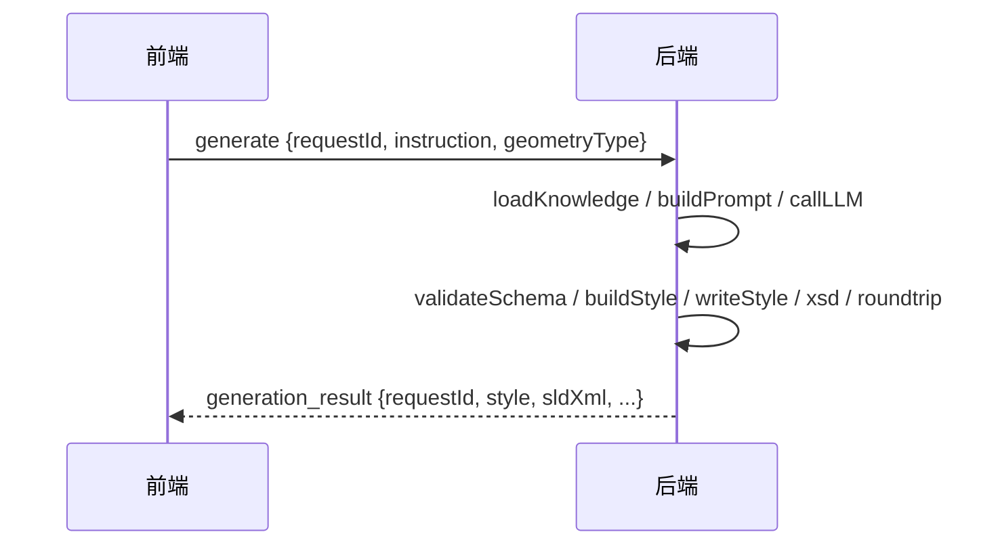
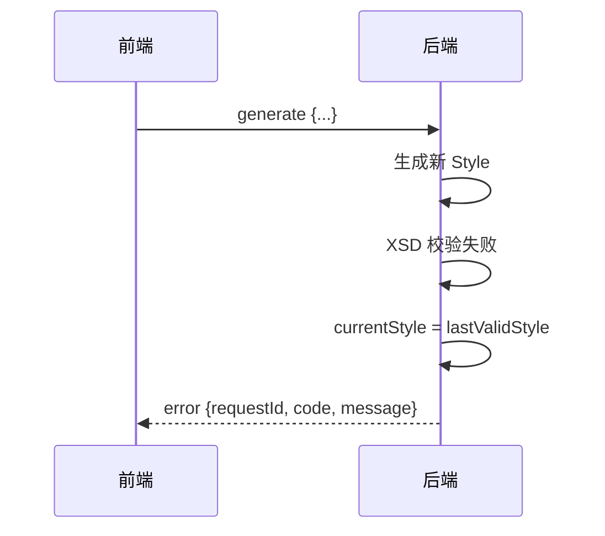
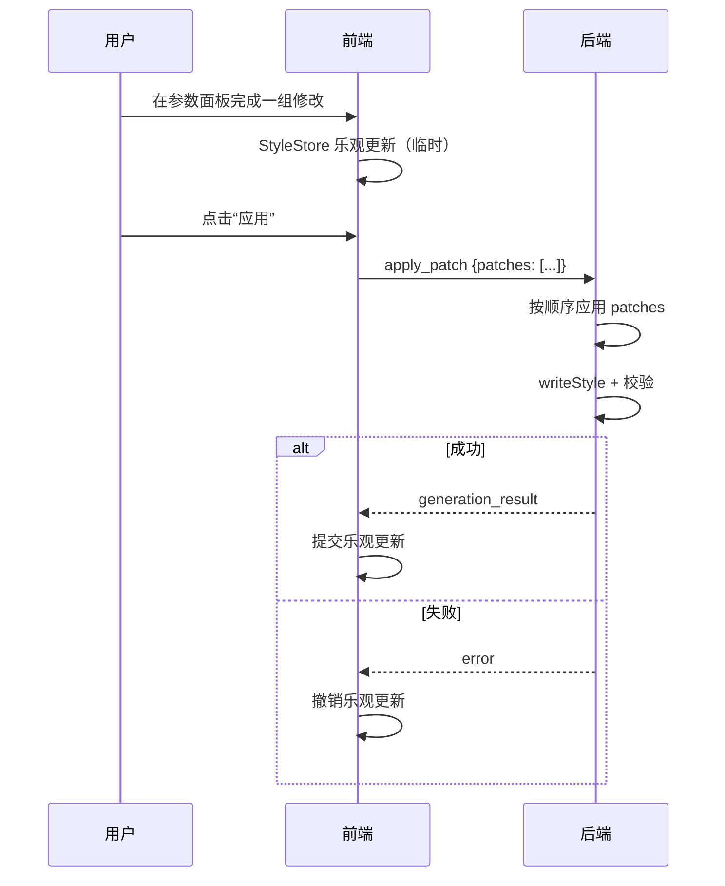

# 前后端接口契约（WebSocket）

> 文档定位：SLDAgent 前端（Vue/Electron）与后端（Node/TS Agent）之间的 WebSocket 消息契约。  
> 配套设计：[architecture.html](architecture.html)

---

## 1. 设计目标

- **单一协议**：前后端只通过 WebSocket 通信，Electron 主进程仅做透明转发。
- **请求-响应可追踪**：每条请求携带 `requestId`，响应原样带回。
- **状态变更推送**：后端完成样式生成/修改后，通过响应消息把新的权威状态推送给前端。
- **错误统一**：所有错误都通过 `error` 消息返回，前端统一处理。

---

## 2. 基础消息信封

```typescript
interface WsMessage {
  /** 消息类型，见下表 */
  type: string;
  /** 请求唯一标识，前端生成；响应原样带回 */
  requestId: string;
  /** 负载，随 type 变化 */
  payload: unknown;
  /** 服务端时间戳，响应时填充 */
  timestamp?: number;
}
```

**约定**：
- 前端发送的消息 `timestamp` 可选；后端响应必须填充 `timestamp`。
- `requestId` 使用 `crypto.randomUUID()` 或等效方式生成。
- 后端**不会主动推送** unsolicited 消息（除 `ping`/`pong` 外），所有状态变更都通过请求的响应返回。

---

## 3. 消息类型总览

| 类型 | 方向 | 说明 |
|---|---|---|
| `generate` | F → B | 自然语言生成新样式 |
| `modify` | F → B | 基于当前样式做增量修改 |
| `apply_patch` | F → B | 批量提交用户在 UI 上做的参数化精修（确认后提交模式） |
| `import_style` | F → B | 导入已有 GeoStyler Style（通常由前端 parser 解析 SLD 后传入） |
| `export` | F → B | 请求后端生成 SLD XML 并校验（实际落盘由前端 FileService 完成） |
| `validate` | F → B | 对当前样式主动执行完整校验 |
| `get_domains` | F → B | 获取可用知识库领域列表 |
| `set_domain` | F → B | 切换当前激活领域 |
| `set_data_schema` | F → B | 上传 GeoJSON/Shapefile 解析出的字段 schema |
| `generation_result` | B → F | generate/modify/apply_patch/import_style 的成功响应 |
| `export_result` | B → F | export 的成功响应 |
| `validation_result` | B → F | validate 的成功响应 |
| `domains_result` | B → F | get_domains 的响应 |
| `error` | B → F | 任意请求失败后的统一错误响应 |
| `ping` / `pong` | 双向 | 保活 |

---

## 4. 请求 / 响应消息详情

### 4.1 `generate` — 自然语言生成

**请求**

```typescript
interface GenerateRequest {
  /** 用户原始自然语言指令 */
  instruction: string;
  /** 目标几何类型 */
  geometryType: 'point' | 'line' | 'polygon' | 'raster';
  /** 目标业务领域，不传则使用 default */
  domain?: string;
  /** 数据 schema，用于属性驱动样式 */
  dataSchema?: DataSchema;
}
```

**成功响应** `generation_result`

```typescript
interface GenerationResult {
  /** 当前权威 GeoStyler Style */
  style: Style;
  /** 生成的 SLD 1.0.0 XML */
  sldXml: string;
  /** LLM 解析出的结构化参数 */
  params: StyleParams;
  /** 校验报告 */
  validation: ValidationReport;
  /** 给用户看的解释说明 */
  explanation: string;
}
```

**失败响应** `error`

```typescript
interface ErrorPayload {
  /** 对应请求的 requestId */
  requestId: string;
  /** 错误码，见 §6 */
  code: ErrorCode;
  /** 人类可读错误信息 */
  message: string;
  /** 可选的字段级错误详情 */
  details?: ValidationError[];
  /** 若后端已回退，此处为回退后的当前 style */
  style?: Style;
  /** 会话是否忙碌 */
  busy?: boolean;
}
```

---

### 4.2 `modify` — 多轮增量修改

**请求**

```typescript
interface ModifyRequest {
  /** 用户追加指令 */
  instruction: string;
  /**
   * 明确要求保留的字段列表。
   * 后端在生成新参数时会把这里列出的字段标记为“不可变更”。
   */
  preserve?: string[];
}
```

**响应**：同 `generation_result`。

**关键约定**：
- 后端始终基于 `AgentSession.currentStyle` 做增量合并。
- 调用 LLM 时，prompt 中携带完整前序 `StyleParams` 与 `preserve` 列表，以提升字段保留准确率（Spike 验证可达 100%）。
- LLM 输出会先经过 `ParamsNormalizer` 做字段别名归一化（如 `font_color → stroke_color`），再进入 schema 校验与 StyleBuilder。
- 若 `preserve` 为空，则默认保留 `geometry_type` 和 `style_type`。
- 失败时后端回退到 `lastValidStyle`，响应 `error`。

---

### 4.3 `apply_patch` — UI 参数化精修提交

**请求**

```typescript
interface ApplyPatchRequest {
  /** RFC 6902 JSON Patch 子集，描述对当前 `StyleParams` 的修改。
   *  路径为 JSON Pointer，目标字段是 `StyleParams` 而非 GeoStyler Style，例如：
   *    /fill_color、/rules/0/name、/categories/-/label
   *  支持多条 patch 原子性应用，MVP 采用“确认后提交”模式：
   *  用户在前端参数面板/规则列表/分类表格中完成一组修改后，
   *  点击“应用”才统一发送。 */
  patches: StylePatch[];
}

/** 简化版 Patch：只支持 replace / add / remove 单条路径 */
interface StylePatch {
  op: 'replace' | 'add' | 'remove';
  /** JSON Pointer，指向 `StyleParams` 字段，例如 /fill_color、/rules/0/filter、/categories/- */
  path: string;
  value?: unknown;
}
```

**响应**：同 `generation_result`。

**关键约定**：
- `apply_patch` 的 `patches` 目标对象是 **`StyleParams`**，而非 `GeoStyler Style`。
- 后端将 patches 应用到 `AgentSession.params`，经 `StyleParamsValidator` 校验、`ParamsNormalizer` 归一化后，由 `StyleBuilder` 重建 `GeoStyler Style`。
- 路径示例：`/fill_color`（修改填充色）、`/rules/0/name`（修改规则名）、`/categories/-`（追加分类）、`/rules/0/filter`（替换过滤器）。
- 前端可以本地乐观更新 `params`，但 `currentStyle` 仍由后端返回的 `GenerationResult` 权威更新；后端失败时前端需撤销对 `params` 的乐观修改。
- 后端按数组顺序应用所有 patch，再统一执行 `writeStyle + 校验`；任一环节失败则整批回退到 `lastValidStyle` 与 `lastValidParams`。
- MVP 不采用“即时提交”（每改一个字段就发一次 WS），以降低校验频率并保证状态一致性。

---

### 4.4 `import_style` — 导入已有 GeoStyler Style

**请求**

```typescript
interface ImportStyleRequest {
  /** 前端用 geostyler-sld-parser 解析出的 Style */
  style: Style;
  /** 来源文件名，用于最近文件列表 */
  sourceName?: string;
}
```

**响应**：同 `generation_result`。

**关键约定**：
- 后端再次执行 `writeStyle + 校验`，确认前端解析结果可重新写出为标准 SLD。
- 成功后 `currentStyle` 和 `lastValidStyle` 都替换为导入的 Style。

---

### 4.5 `export` — 导出 SLD XML

**请求**

```typescript
interface ExportRequest {
  /** 要导出的 GeoStyler Style；不传则使用后端 currentStyle */
  style?: Style;
  /** 导出选项 */
  options?: {
    includeXmlDeclaration?: boolean; // 默认 true
    prettyPrint?: boolean;            // 默认 true
    encoding?: string;                // 默认 UTF-8
  };
}
```

**成功响应** `export_result`

```typescript
interface ExportResult {
  sldXml: string;
  validation: ValidationReport;
  /** 生成时间戳 */
  generatedAt: number;
}
```

**关键约定**：
- 后端只负责生成 XML 和校验，**不直接写文件**。
- 前端 `FileService` 拿到 `sldXml` 后再弹出保存对话框落盘。
- 若校验失败，返回 `error`，前端提示用户“仅导出 XML / 取消”。

---

### 4.6 `validate` — 主动校验

**请求**

```typescript
interface ValidateRequest {
  /** 要校验的 Style；不传则校验后端 currentStyle */
  style?: Style;
}
```

**响应** `validation_result`

```typescript
interface ValidationResultPayload {
  style: Style;
  validation: ValidationReport;
}
```

---

### 4.7 `get_domains` / `domains_result`

**响应**

```typescript
interface DomainsResult {
  domains: DomainInfo[];
  activeDomain: string;
}

interface DomainInfo {
  id: string;
  name: string;
  description: string;
  default: boolean;
}
```

---

### 4.8 `set_domain`

**请求**

```typescript
interface SetDomainRequest {
  domain: string;
}
```

**响应**：`domains_result`（更新后的领域列表与激活项）。

---

### 4.9 `set_data_schema`

**请求**

```typescript
interface SetDataSchemaRequest {
  dataSchema: DataSchema;
}
```

**响应**：`ok`

```typescript
interface OkPayload {
  ok: true;
}
```

---

## 5. 共享类型速查

```typescript
// GeoStyler Style 类型直接复用 geostyler-style
import { Style, Rule, Symbolizer, Filter } from 'geostyler-style';

interface DataSchema {
  /** 字段列表 */
  properties: PropertySchema[];
  /** 几何类型 */
  geometryType?: 'point' | 'line' | 'polygon' | 'raster';
  /** 采样要素数 */
  sampleCount?: number;
}

interface PropertySchema {
  name: string;
  type: 'string' | 'number' | 'integer' | 'boolean' | 'date';
  /** 采样值，用于 LLM 理解 */
  samples?: unknown[];
  /** 数值字段的最小/最大值 */
  min?: number;
  max?: number;
}

interface ValidationReport {
  passed: boolean;
  /** JSON Schema 校验结果 */
  schema?: ValidationResult;
  /** xmllint XSD 校验结果 */
  xsd?: ValidationResult;
  /** Parser 双向可读性校验结果 */
  roundtrip?: ValidationResult;
  errors: ValidationError[];
}

interface ValidationResult {
  passed: boolean;
  /** 耗时 ms */
  durationMs?: number;
  /** 工具版本或命令 */
  tool?: string;
}

interface ValidationError {
  /** 错误来源：schema / xsd / roundtrip / builder */
  source: string;
  /** 人类可读信息 */
  message: string;
  /** 可选：出错的字段或 XML 行号 */
  location?: string;
  /** 可选：原始错误对象序列化 */
  meta?: unknown;
}

enum ErrorCode {
  INVALID_REQUEST = 'INVALID_REQUEST',
  SCHEMA_VALIDATION_FAILED = 'SCHEMA_VALIDATION_FAILED',
  LLM_ERROR = 'LLM_ERROR',
  BUILDER_ERROR = 'BUILDER_ERROR',
  SLD_PARSE_ERROR = 'SLD_PARSE_ERROR',
  XSD_VALIDATION_FAILED = 'XSD_VALIDATION_FAILED',
  ROUNDTRIP_VALIDATION_FAILED = 'ROUNDTRIP_VALIDATION_FAILED',
  DOMAIN_NOT_FOUND = 'DOMAIN_NOT_FOUND',
  INTERNAL_ERROR = 'INTERNAL_ERROR',
}
```

---

## 6. 错误码

| 错误码 | 场景 | 前端处理建议 |
|---|---|---|
| `INVALID_REQUEST` | 消息格式错误、缺少必填字段 | 提示“请求格式错误”，记录日志 |
| `SCHEMA_VALIDATION_FAILED` | LLM 输出不符合 JSON Schema | 展示具体字段错误，可重试 |
| `LLM_ERROR` | 模型调用失败 / 超时 / 内容被过滤 | 提示模型不可用，允许切换模型 |
| `BUILDER_ERROR` | StyleBuilder 无法把参数转为 GeoStyler Style | 展示错误字段 |
| `SLD_PARSE_ERROR` | 导入的 SLD 无法解析 | ValidationPanel 标记失败原因 |
| `XSD_VALIDATION_FAILED` | 生成/导入的 SLD 未通过 OGC XSD | 显示具体 XSD 错误 |
| `ROUNDTRIP_VALIDATION_FAILED` | Parser 反向读取失败 | 提示“生成的 SLD 不可再编辑” |
| `DOMAIN_NOT_FOUND` | 切换的领域不存在 | 提示可用领域列表 |
| `INTERNAL_ERROR` | 未知内部错误 | 提示“内部错误”，记录日志 |

---

## 7. 超时与并发

| 消息类型 | 建议超时 | 说明 |
|---|---|---|
| `generate` | 30s | NFR 首轮 ≤10s，预留重试与网络抖动 |
| `modify` | 30s | 同 generate |
| `apply_patch` | 10s | 本地计算，通常 <1s |
| `import_style` | 15s | 含 writeStyle + 校验 |
| `export` | 15s | 含 writeStyle + 校验 |
| `validate` | 15s | 含 XSD 校验 |
| `ping` | 5s | 保活 |

**并发约定**：
- 每个 `AgentSession` 同一时刻只允许一个 `generate` / `modify` / `apply_patch` 在执行。
- 若前端在上一轮未完成时发送新的生成/修改请求，后端返回 `INVALID_REQUEST` 并附带 `busy: true`。
- 前端应在 UI 上禁用“发送”按钮，避免重复提交。

---

## 8. 典型时序

### 8.1 generate 成功



### 8.2 generate 失败并回退



### 8.3 apply_patch 确认后提交



- MVP 采用“确认后提交”：用户改完一组参数后统一发送 `patches`。
- 后端原子性应用整批 patch，失败则回退到 `lastValidStyle`。

---

## 9. Electron 启动与生命周期

本契约假定前端（Vue 渲染进程）直接通过原生 `WebSocket` 与后端通信，Electron 主进程仅负责后端子进程的生命周期管理。SP-03 已验证该模式可行。

### 9.1 启动流程

1. Electron 主进程启动 Node WebSocket 后端子进程（`spawn(process.execPath, [serverPath])`）。
2. 后端子进程向 stdout 输出 `READY ws://localhost:{port}`。
3. 主进程解析端口后，通过 `file://renderer/index.html?port={port}` 加载渲染页。
4. 渲染进程从 URL 参数读取端口，使用原生 `WebSocket` 直连后端。

### 9.2 停止流程

- `app.on('before-quit')` 与 `window-all-closed'` 中调用 `child.kill('SIGTERM')` 关闭后端。
- 确保 Electron 退出后无残留 `node` 后端进程。

### 9.3 环境陷阱

当前开发环境可能全局设置 `ELECTRON_RUN_AS_NODE=1`，导致 `require('electron')` 返回路径字符串、`app` 不可用。启动器应在启动 Electron 前 `delete process.env.ELECTRON_RUN_AS_NODE`。

### 9.4 打包路径

- 开发期：`server.js` 与主进程脚本同处 `SourceCode/backend/src/`。
- 生产期：将后端脚本及 `node_modules` 依赖放入 Electron Builder `extraResources/backend/`，主进程通过 `process.resourcesPath` 解析。

> 来源：[spike/electron-ws-startup/result.md](../../../spike/electron-ws-startup/result.md)。

---

## 9. 文件位置建议

```
SourceCode/
├── shared/
│   ├── index.ts
│   ├── types.ts        # StyleParams, DataSchema, ValidationReport ...
│   └── messages.ts     # WsMessage / Request / Response 类型
├── backend/
│   └── ...
└── frontend/
    └── ...
```

---

## 10. 版本历史

| 版本 | 日期 | 说明 |
|---|---|---|
| 0.4 | 2026-06-15 | 修正 `set_data_schema` 响应为 `OkPayload { ok: true }`；修正 `ErrorPayload.details` 类型为 `ValidationError[]` |
| 0.3 | 2026-06-15 | 对齐 MVP 参数化精修：`apply_patch` 改为批量 `patches`，明确“确认后提交”模式 |
| 0.2 | 2026-06-14 | 同步 SP-03 结论：增加 Electron 启动与生命周期章节 |
| 0.1 | 2026-06-13 | 初始接口契约，覆盖 generate / modify / apply_patch / import / export / validate |
