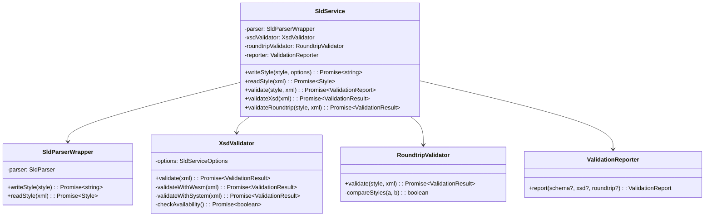
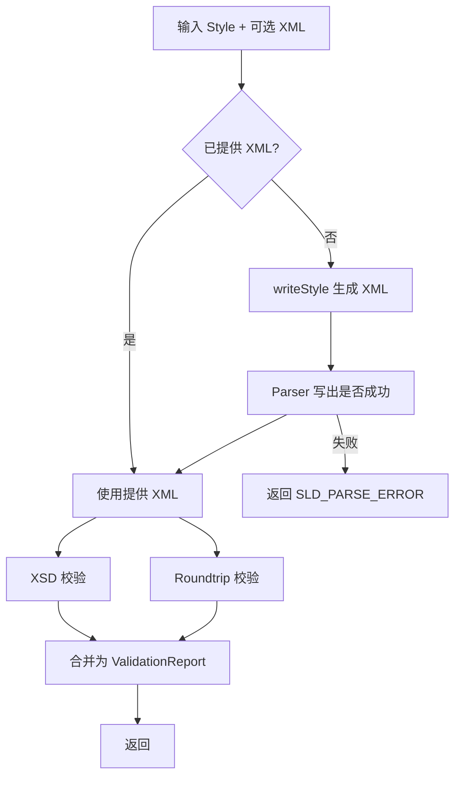
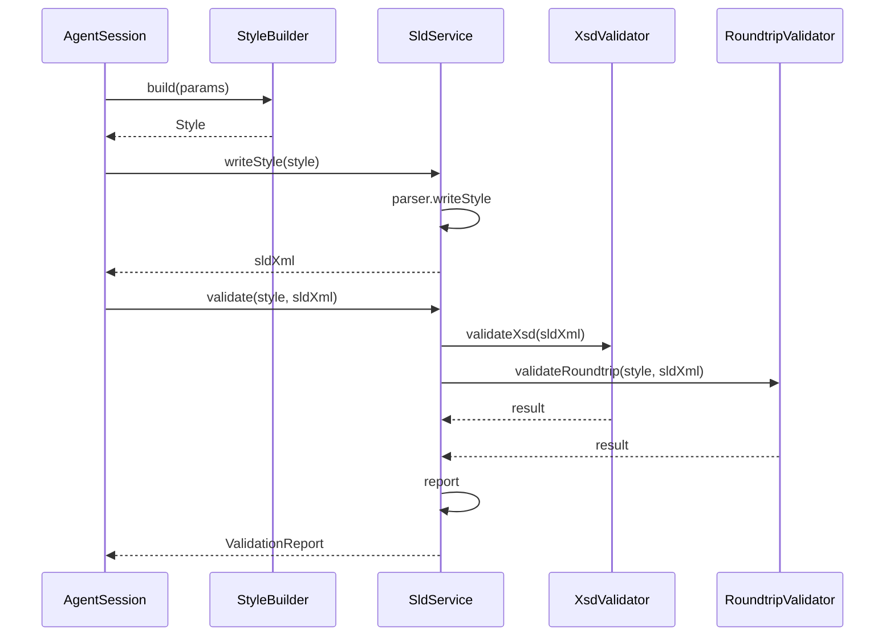

# SldService 设计

> 文档定位：SLD XML 读写、OGC XSD 校验、Parser 双向可读性校验的封装层。  
> 配套契约：[interface-contracts.md](interface-contracts.md)

---

## 1. 职责

- 使用 `geostyler-sld-parser` 完成 `Style ↔ SLD XML` 双向转换。
- 使用系统 `xmllint` 对生成的 XML 做 OGC SLD 1.0.0 XSD 校验。
- 对生成的 SLD 做 Parser 反向读取校验，确保可再编辑。
- 把多来源校验结果汇总为统一的 `ValidationReport`。

---

## 2. 核心类

```typescript
class SldService {
  constructor(options?: SldServiceOptions);

  /** 将 GeoStyler Style 写出为 SLD 1.0.0 XML */
  async writeStyle(style: Style, options?: WriteOptions): Promise<string>;

  /** 将 SLD 1.0.0 XML 读回 GeoStyler Style */
  async readStyle(xml: string): Promise<Style>;

  /** 完整校验：XSD + Parser Roundtrip */
  async validate(style: Style, xml?: string): Promise<ValidationReport>;

  /** 单独 XSD 校验 */
  async validateXsd(xml: string): Promise<ValidationResult>;

  /** 单独 Parser Roundtrip 校验 */
  async validateRoundtrip(style: Style, xml?: string): Promise<ValidationResult>;
}

interface SldServiceOptions {
  /** 本地 XSD 路径，开发期默认 Document/Research/sld/1.0.0/StyledLayerDescriptor.xsd */
  xsdPath?: string;
  /** xmllint 可执行文件路径，默认 'xmllint' */
  xmllintPath?: string;
  /** 是否跳过 XSD 校验（用于 xmllint 缺失的降级场景） */
  skipXsd?: boolean;
  /** xmllint-wasm schema bundle 目录；提供时优先使用 WASM 校验（推荐生产打包） */
  wasmSchemaBundleDir?: string;
  /** 是否强制使用 xmllint-wasm */
  useWasm?: boolean;
}

interface WriteOptions {
  includeXmlDeclaration?: boolean;
  prettyPrint?: boolean;
  encoding?: string;
}
```

---

## 3. 类图



---

## 4. 写 SLD

```typescript
async writeStyle(style: Style, options?: WriteOptions): Promise<string> {
  const parser = new SldParser();
  const { output: sldXml } = await parser.writeStyle(style);

  if (options?.prettyPrint ?? true) {
    return this.prettyPrint(sldXml);
  }
  return sldXml;
}
```

### 4.1 写出选项

| 选项 | 默认 | 说明 |
|---|---|---|
| `includeXmlDeclaration` | `true` | 是否在 XML 开头添加 `<?xml ... ?>` |
| `prettyPrint` | `true` | 是否格式化缩进 |
| `encoding` | `'UTF-8'` | 声明中的编码 |

### 4.2 格式化

`geostyler-sld-parser` 通常输出紧凑 XML。可使用 `xml-formatter` 或内置方法格式化。MVP 建议引入轻量 `xml-formatter` 依赖。

---

## 5. 读 SLD

```typescript
async readStyle(xml: string): Promise<Style> {
  // geostyler-sld-parser@9.0.1 无法处理 symbolizer 内部的显式 <Geometry> 元素
  // 先剥离该节点，避免导入时崩溃。
  const cleanedXml = this.stripSymbolizerGeometry(xml);

  const parser = new SldParser();
  const { output: style, errors } = await parser.readStyle(cleanedXml);

  if (errors?.length) {
    throw new SldAgentError(ErrorCode.SLD_PARSE_ERROR, 'Failed to parse SLD', { details: errors });
  }

  return style as Style;
}

private stripSymbolizerGeometry(xml: string): string {
  // 轻量正则/XML 处理：移除 <Geometry>...</Geometry> 节点，保留其他内容。
  // 仅处理 SLD 1.0.0 命名空间下的 Geometry 子节点。
  return xml.replace(/<\w*:?Geometry\b[^>]*>[\s\S]*?<\/\w*:?Geometry\s*>/g, '');
}
```

> **Spike 结论**：示例 SLD 与部分 GeoServer 导出文件包含 `<Geometry><ogc:PropertyName>...</ogc:PropertyName></Geometry>`，会导致 parser 抛出 `Cannot read properties of undefined (reading 'map')`。导入前需剥离。详见 [spike/parser-e2e/report.md](../../../spike/parser-e2e/report.md)。

---

## 6. XSD 校验

### 6.1 实现

```typescript
class XsdValidator {
  constructor(private options: SldServiceOptions) {}

  async validate(xml: string): Promise<ValidationResult> {
    if (this.options.wasmSchemaBundleDir || this.options.useWasm) {
      return this.validateWithWasm(xml);
    }
    return this.validateWithSystem(xml);
  }

  private async validateWithWasm(xml: string): Promise<ValidationResult> {
    const { validateXML } = await import('xmllint-wasm');
    const start = Date.now();
    try {
      const bundleDir = this.options.wasmSchemaBundleDir!;
      const files = readdirSync(bundleDir).filter(f => f.endsWith('.xsd'));
      const schemas = files.map(fileName => ({
        fileName,
        contents: readFileSync(resolve(bundleDir, fileName), 'utf-8'),
      }));
      // 主 schema 必须放在第一位
      schemas.sort((a, b) =>
        a.fileName === 'StyledLayerDescriptor.xsd' ? -1
        : b.fileName === 'StyledLayerDescriptor.xsd' ? 1
        : 0
      );
      const [main, ...deps] = schemas;
      const result = await validateXML({
        xml: [{ fileName: 'style.sld', contents: xml }],
        schema: [main],
        preload: deps,
      });

      if (result.valid) {
        return { passed: true, durationMs: Date.now() - start, tool: 'xmllint-wasm' };
      }
      return {
        passed: false,
        durationMs: Date.now() - start,
        tool: 'xmllint-wasm',
        message: result.errors.map(e => e.message).join('\n'),
      };
    } catch (err: any) {
      return {
        passed: false,
        durationMs: Date.now() - start,
        tool: 'xmllint-wasm',
        message: err.message,
      };
    }
  }

  private async validateWithSystem(xml: string): Promise<ValidationResult> {
    const available = await this.checkAvailability();
    const tool = this.options.xmllintPath || 'xmllint';
    const xsdPath = this.options.xsdPath || DEFAULT_XSD;
    if (!available) {
      return {
        passed: false,
        message: 'xmllint not available',
        tool,
      };
    }

    const start = Date.now();
    try {
      await execFilePromise(tool, [
        '--noout',
        '--schema', xsdPath,
        '-',
      ], { input: xml });
      return { passed: true, durationMs: Date.now() - start, tool };
    } catch (err: any) {
      return {
        passed: false,
        durationMs: Date.now() - start,
        tool,
        message: err.stderr || err.message,
      };
    }
  }

  private async checkAvailability(): Promise<boolean> {
    const tool = this.options.xmllintPath || 'xmllint';
    try {
      await execFilePromise(tool, ['--version']);
      return true;
    } catch {
      return false;
    }
  }
}
```

### 6.2 系统 xmllint 命令参数

```bash
xmllint --noout --schema Document/Research/sld/1.0.0/StyledLayerDescriptor.xsd -
```

- `--noout`：只校验不输出 XML。
- `--schema`：指定本地 XSD。
- `-`：从标准输入读取 XML。

> 生产打包场景优先使用 `xmllint-wasm`（见 §6.1），仅在开发环境调用系统 `xmllint`。

### 6.3 降级策略

当 `xmllint` 不可用时：

1. 记录 warning。
2. 使用 Parser Roundtrip 校验作为核心校验。
3. 可选：用轻量 XML 语法校验（如 `fast-xml-parser`）检查标签闭合、命名空间。

详细降级方案见 [xmllint-packaging.md](xmllint-packaging.md)。

### 6.4 Schema Bundle 生成与路径

生产打包时，`SldService` 不直接联网下载 XSD，而是依赖构建阶段生成的本地 bundle：

- **构建脚本**：`scripts/download-sld-schemas.js`（原型见 [spike/xmllint-wasm-bundle/scripts/download-sld-schemas.js](../../../spike/xmllint-wasm-bundle/scripts/download-sld-schemas.js)）。
- **输出目录**：开发期 `spike/xmllint-wasm-bundle/schemas/`；生产期建议打包到 `resources/sld-schemas/`。
- **运行时加载**：`SldService` 启动时读取目录下所有 `.xsd`，将 `StyledLayerDescriptor.xsd` 作为主 schema，其余作为 `preload`。
- **路径策略**：
  - 开发：`resolve(process.cwd(), 'schemas')` 或从环境变量 `SLD_SCHEMA_DIR` 读取。
  - 生产：`resolve(process.resourcesPath, 'sld-schemas')`。

> 若 bundle 缺失且 `skipXsd` 为 `false`，`SldService` 初始化应抛出明确错误，避免运行时才暴露。

## 7. Parser Roundtrip 校验

### 7.1 实现

```typescript
class RoundtripValidator {
  async validate(style: Style, xml?: string): Promise<ValidationResult> {
    const sldXml = xml ?? await this.parser.writeStyle(style);
    const start = Date.now();

    try {
      const { output: reparsed } = await this.parser.readStyle(sldXml);
      const equivalent = this.compareStyles(style, reparsed);

      return {
        passed: equivalent,
        durationMs: Date.now() - start,
        tool: 'geostyler-sld-parser',
        message: equivalent ? undefined : 'Roundtrip style mismatch',
      };
    } catch (err: any) {
      return {
        passed: false,
        durationMs: Date.now() - start,
        tool: 'geostyler-sld-parser',
        message: err.message,
      };
    }
  }
}
```

### 7.2 Style 比对策略

```typescript
private compareStyles(original: Style, reparsed: Style): boolean {
  // 简化比对：比较关键字段
  return (
    original.name === reparsed.name &&
    original.rules.length === reparsed.rules.length &&
    this.compareRules(original.rules, reparsed.rules)
  );
}
```

**注意**：完全不损的 roundtrip 在复杂 SLD 上可能难以做到。MVP 阶段可放宽为：
- 能成功 `readStyle`。
- Rule 数量和 Symbolizer 类型一致。
- 关键字段（颜色、线宽、filter 字段名）一致。

---

## 8. 完整校验流水线



```typescript
async validate(style: Style, xml?: string): Promise<ValidationReport> {
  let sldXml = xml;
  try {
    sldXml ??= await this.writeStyle(style);
  } catch (err) {
    return this.reporter.report({
      schema: undefined,
      xsd: { passed: false, message: 'Failed to write SLD', tool: 'geostyler-sld-parser' },
      roundtrip: undefined,
    });
  }

  const [xsd, roundtrip] = await Promise.all([
    this.validateXsd(sldXml),
    this.validateRoundtrip(style, sldXml),
  ]);

  return this.reporter.report({ xsd, roundtrip });
}
```

---

## 9. ValidationReport 生成

```typescript
class ValidationReporter {
  report(results: { schema?: ValidationResult; xsd?: ValidationResult; roundtrip?: ValidationResult }): ValidationReport {
    const errors: ValidationError[] = [];

    if (results.schema && !results.schema.passed) {
      errors.push({ source: 'schema', message: results.schema.message || 'Schema validation failed' });
    }
    if (results.xsd && !results.xsd.passed) {
      errors.push({ source: 'xsd', message: results.xsd.message || 'XSD validation failed' });
    }
    if (results.roundtrip && !results.roundtrip.passed) {
      errors.push({ source: 'roundtrip', message: results.roundtrip.message || 'Roundtrip validation failed' });
    }

    return {
      passed: errors.length === 0,
      schema: results.schema,
      xsd: results.xsd,
      roundtrip: results.roundtrip,
      errors,
    };
  }
}
```

---

## 10. 错误码映射

| 异常 | 错误码 | 说明 |
|---|---|---|
| `writeStyle` 失败 | `SLD_PARSE_ERROR` | Parser 无法写出 |
| `readStyle` 失败 | `SLD_PARSE_ERROR` | 导入的 SLD 无法解析 |
| XSD 校验失败 | `XSD_VALIDATION_FAILED` | XML 不符合 OGC XSD |
| Roundtrip 失败 | `ROUNDTRIP_VALIDATION_FAILED` | 反向读取后与原文不一致 |
| xmllint 缺失 | `XSD_VALIDATION_FAILED`（降级） | 在报告里标注 `tool unavailable` |

---

## 11. 与 AgentSession 的协作



---

## 12. 待细化点

- XSD 校验失败时，如何精确定位到 XML 行号/字段并回传给前端展示。
- Roundtrip 比对是否应采用严格深等还是语义等价。
- `xmllint` 不可用时保留系统 `xmllint` 降级与 `xmllint-wasm` 的切换策略细节（已选定主方案，见 [xmllint-packaging.md](xmllint-packaging.md)）。
- 导入 SLD 时是否要做 XSD 校验（建议做），以及如何复用同一 `XsdValidator`。
