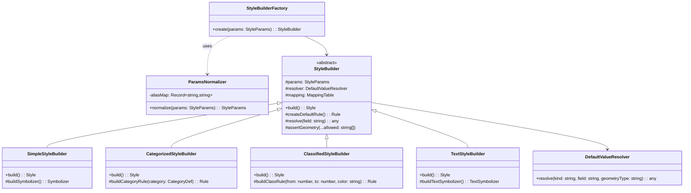

# StyleBuilder 设计

> 文档定位：LLM 输出参数 → GeoStyler Style 的映射层。  
> 配套契约：[interface-contracts.md](interface-contracts.md)、[agent-session.md](agent-session.md)

---

## 1. 职责

- 将受 JSON Schema 约束的 `StyleParams` 转换为 `geostyler-style` 的 `Style` 对象。
- 根据 `style_type` 分发到不同子 Builder。
- 补全默认值、处理单位、校验几何类型与 Symbolizer 的匹配关系。
- 捕获构建异常并转换为业务错误。
- **输出的 `Style` 对象同时供 `SldService` 生成 SLD 与前端 `MapPreview` 做 OpenLayers 实时渲染**（通过 `geostyler-openlayers-parser`），见 [`spike/openlayers-preview/result.md`](../../../spike/openlayers-preview/result.md)。

---

## 2. 输入参数结构（StyleParams）

> `StyleParams` 是 LLM 输出、JSON Schema、前端参数化精修面板共同使用的统一契约。前端表单中的颜色、线宽、透明度等字段直接对应到以下字段，修改后通过 `apply_patch` 提交。

```typescript
interface StyleParams {
  /** 样式名称 */
  style_name: string;
  /** 目标几何类型 */
  geometry_type: 'point' | 'line' | 'polygon' | 'raster';
  /** 样式类型 */
  style_type: 'simple' | 'categorized' | 'classified' | 'text' | 'raster';
  /** 属性驱动样式时使用的字段名 */
  field_name?: string;

  // 通用视觉参数
  fill_color?: string;
  fill_opacity?: number;
  stroke_color?: string;
  stroke_width?: number;
  stroke_opacity?: number;
  stroke_dasharray?: string;
  stroke_linecap?: 'butt' | 'round' | 'square';
  stroke_linejoin?: 'miter' | 'round' | 'bevel';
  opacity?: number;

  // 点参数
  well_known_name?: 'circle' | 'square' | 'triangle' | 'star' | 'cross' | 'x';
  size?: number;
  rotation?: number;

  // 线参数
  line_offset?: number;

  // 分类 / 分级
  categories?: CategoryDef[];
  classes?: number;
  classification_method?: 'equalInterval' | 'quantile' | 'naturalBreaks';
  color_ramp?: string[];
  color_scheme?: string; // 预定义色带名，如 "YlOrRd"

  // 文本标注
  label?: string;
  font_family?: string;
  font_size?: number;
  font_weight?: 'normal' | 'bold';
  font_style?: 'normal' | 'italic' | 'oblique';
  halo_color?: string;
  halo_radius?: number;
  placement?: 'point' | 'line';
  offset?: [number, number];

  // 规则级通用
  rules?: RuleParams[];
  min_scale?: number;
  max_scale?: number;
}

interface CategoryDef {
  value: string | number | boolean;
  label?: string;
  fill_color?: string;
  stroke_color?: string;
  stroke_width?: number;
}

interface RuleParams {
  name?: string;
  filter?: Filter;
  min_scale?: number;
  max_scale?: number;
  symbolizers?: SymbolizerParams[];
}

interface SymbolizerParams {
  kind: 'Mark' | 'Line' | 'Fill' | 'Text' | 'Raster';
  [key: string]: unknown;
}
```

---

## 3. 三层字段映射

```
JSON Schema 字段        GeoStyler Style 字段        SLD CssParameter
----------------        ---------------------        ----------------
fill_color              FillSymbolizer.color         fill
fill_opacity            FillSymbolizer.opacity       fill-opacity
stroke_color            LineSymbolizer.color         stroke
stroke_width            LineSymbolizer.width         stroke-width
stroke_opacity          LineSymbolizer.opacity       stroke-opacity
stroke_dasharray        LineSymbolizer.dasharray     stroke-dasharray
stroke_linecap          LineSymbolizer.lineCap       stroke-linecap
stroke_linejoin         LineSymbolizer.lineJoin      stroke-linejoin
well_known_name         MarkSymbolizer.wellKnownName WellKnownName
size                    MarkSymbolizer.size          size
rotation                MarkSymbolizer.rotation      rotation
label                   TextSymbolizer.label         Label / PropertyName
font_family             TextSymbolizer.font          font-family
font_size               TextSymbolizer.size          font-size
```

映射表由 `KnowledgeBaseLoader` 提供，Builder 运行时查询，不硬编码。

实际映射条目来自 JSON 知识库（`knowledge/root.json` + 领域文件），随 `geometry_type`、`style_type`、`domain` 动态加载。详见 [agent-session.md §3.5](agent-session.md) 与 [spike/knowledge-base-prompt/result.md](../../../spike/knowledge-base-prompt/result.md)。

---

## 4. 参数归一化（ParamsNormalizer）

### 4.1 为什么需要

Spike 验证发现，即使 JSON Schema 中设置了 `additionalProperties: false`，LLM 仍可能输出语义合理但不在 schema 中的字段名。例如文本样式中，模型倾向使用 `font_color` 而不是 schema 标准的 `stroke_color`。

因此，在 `StyleBuilder` 构建之前，需要增加一层 `ParamsNormalizer`，将已知的 LLM 语义别名映射为 schema 标准字段。

### 4.2 位置

```
LLM 输出 (StyleParams-like JSON)
        ↓
JSON.parse + JSON Schema 校验
        ↓
ParamsNormalizer.applyAliases()
        ↓
StyleBuilder.build()
        ↓
GeoStyler Style
```

### 4.3 别名表

| LLM 常用别名 | 标准字段 | 说明 |
|---|---|---|
| `font_color` | `stroke_color` | 文本颜色。GeoStyler `TextSymbolizer` 复用 `color`，SLD 对应 `fill`，但 schema 层面统一用 `stroke_color` 表示描边/文本色。 |
| `font_name` | `font_family` | 字体族名。 |

> **来源**：[spike/llm-json-styleparams/result.md](../../../spike/llm-json-styleparams/result.md)。

### 4.4 行为

```typescript
class ParamsNormalizer {
  private aliasMap: Record<string, string> = {
    font_color: 'stroke_color',
    font_name: 'font_family',
  };

  normalize(params: Record<string, unknown>): StyleParams {
    const normalized = { ...params };
    for (const [alias, canonical] of Object.entries(this.aliasMap)) {
      if (alias in normalized && !(canonical in normalized)) {
        normalized[canonical] = normalized[alias];
        delete normalized[alias];
      }
    }
    return normalized as StyleParams;
  }
}
```

### 4.5 与 Schema 校验的关系

- `ParamsNormalizer` 在 JSON Schema 校验**之后**运行。
- 若 LLM 输出包含 schema 外字段，先由 schema 校验失败；`Normalizer` 只处理已知别名，未知字段仍视为错误。
- 这种设计保持 `additionalProperties: false` 的约束能力，同时兼容 LLM 的常见别名。

---

## 5. Builder 架构

`StyleBuilderFactory` 在创建具体 Builder 之前，会先通过 `ParamsNormalizer` 对 LLM 输出做字段别名归一化，确保传入 Builder 的参数严格符合 `StyleParams` 接口定义。



---

## 6. 各 Builder 行为

### 6.1 SimpleStyleBuilder

- 生成一个 `Rule`，包含一个 Symbolizer（根据 `geometry_type`）。
- 可选附带 `filter`、`minScaleDenominator`、`maxScaleDenominator`。

```typescript
function build(): Style {
  const symbolizer = this.buildSymbolizer();
  return {
    name: this.params.style_name,
    rules: [{
      name: 'Default rule',
      symbolizers: [symbolizer],
      ...(this.params.min_scale ? { scaleDenominator: { min: this.params.min_scale } } : {}),
      ...(this.params.max_scale ? { scaleDenominator: { max: this.params.max_scale } } : {}),
    }],
  };
}
```

### 6.2 CategorizedStyleBuilder

- 每个 `category` 生成一个 `Rule`。
- Rule 的 `filter` 为 `['==', field_name, category.value]`。
- 默认 Rule 不再使用 `elseFilter: true`（`geostyler-sld-parser@9.0.1` 不支持 roundtrip，见 [spike/parser-e2e/report.md](../../../spike/parser-e2e/report.md)）。改为生成一个显式的“不等于所有已知 category 值”Filter。

```typescript
function build(): Style {
  const categories = this.params.categories!;
  const fieldName = this.params.field_name!;

  const rules: Rule[] = categories.map((cat) => ({
    name: cat.label || `${fieldName} = ${cat.value}`,
    filter: ['==', fieldName, cat.value],
    symbolizers: [this.buildSymbolizerForCategory(cat)],
  }));

  // 可选：追加默认 Rule，使用显式 filter 而不是 elseFilter
  if (this.params.include_default_rule !== false) {
    const notEquals = categories.map(c => ['!=', fieldName, c.value] as Filter);
    rules.push({
      name: 'Default',
      filter: notEquals.length === 1
        ? notEquals[0]
        : ['&&', ...notEquals],
      symbolizers: [this.buildDefaultSymbolizer()],
    });
  }

  return { name: this.params.style_name, rules };
}
```

> **Spike 结论**：
> - Parser 写出 SLD 时会丢弃 `elseFilter`，反向读取时也不会还原。
> - Parser 同样不支持 `['!', ['in', field, values]]` 的写出（生成空的 `<ogc:Filter/>`，导致 XSD 校验失败）。
> - 经验证的可用形式是 `['&&', ['!=', field, v1], ['!=', field, v2], ...]`，可完整 roundtrip 并通过 XSD 校验。

### 6.3 ClassifiedStyleBuilder

- 依赖 `RuleGenerator` 计算分级断点。
- 若用户提供了 `classes` 和 `color_ramp`，但无数据 schema，则要求 LLM 同时给出断点（`breakpoints`）。
- 每个级别生成一个 Rule，filter 为区间比较。

```typescript
function build(): Style {
  const breaks = this.params.breakpoints || this.ruleGenerator.computeBreaks(
    this.params.field_name!,
    this.params.classification_method!,
    this.params.classes!,
    this.dataSchema
  );

  const colors = this.colorRampGenerator.interpolate(
    this.params.color_ramp!,
    breaks.length - 1
  );

  const rules: Rule[] = [];
  for (let i = 0; i < breaks.length - 1; i++) {
    const lower = breaks[i];
    const upper = breaks[i + 1];
    rules.push({
      name: `${lower} - ${upper}`,
      filter: ['&&',
        ['>=', this.params.field_name, lower],
        ['<', this.params.field_name, upper],
      ],
      symbolizers: [this.buildSymbolizer({ fill_color: colors[i] })],
    });
  }

  return { name: this.params.style_name, rules };
}
```

### 6.4 TextStyleBuilder

- 生成 `TextSymbolizer`。
- `label` 支持字段名（自动包装为 GeoStyler PropertyName）或常量字符串。

```typescript
function build(): Style {
  return {
    name: this.params.style_name,
    rules: [{
      name: 'Label rule',
      symbolizers: [{
        kind: 'Text',
        label: this.params.label!,
        font: [this.params.font_family || 'sans-serif'],
        size: this.params.font_size || 12,
        color: this.params.stroke_color || '#000000',
        haloColor: this.params.halo_color,
        haloWidth: this.params.halo_radius,
        placement: this.params.placement || 'point',
        offset: this.params.offset,
      }],
    }],
  };
}
```

---

## 7. Symbolizer 构建助手

```typescript
function buildSymbolizerForGeometry(
  geometryType: string,
  params: Partial<StyleParams>
): Symbolizer {
  switch (geometryType) {
    case 'point':
      return {
        kind: 'Mark',
        wellKnownName: params.well_known_name || 'circle',
        size: params.size ?? 6,
        color: params.fill_color || '#000000',
        strokeColor: params.stroke_color,
        strokeWidth: params.stroke_width,
        rotate: params.rotation,
      };
    case 'line':
      return {
        kind: 'Line',
        color: params.stroke_color || '#000000',
        width: params.stroke_width ?? 1,
        opacity: params.stroke_opacity ?? params.opacity ?? 1,
        dasharray: params.stroke_dasharray,
        lineCap: params.stroke_linecap,
        lineJoin: params.stroke_linejoin,
      };
    case 'polygon':
      return {
        kind: 'Fill',
        color: params.fill_color || '#808080',
        opacity: params.fill_opacity ?? params.opacity ?? 1,
        outlineColor: params.stroke_color,
        outlineWidth: params.stroke_width,
        outlineOpacity: params.stroke_opacity,
      };
    default:
      throw new BuilderError(`Unsupported geometry type: ${geometryType}`);
  }
}
```

---

## 8. 默认值解析

```typescript
class DefaultValueResolver {
  resolve(
    kind: 'Mark' | 'Line' | 'Fill' | 'Text',
    field: string,
    geometryType: string,
    domain: string
  ): any {
    // 1. 查当前领域映射表
    const domainDefault = this.kb.getDefault(domain, kind, field);
    if (domainDefault !== undefined) return domainDefault;

    // 2. 查 default 领域
    const globalDefault = this.kb.getDefault('default', kind, field);
    if (globalDefault !== undefined) return globalDefault;

    // 3. 硬编码兜底
    return this.hardcodedFallback(kind, field);
  }
}
```

### 8.1 知识库合并规则

`KnowledgeBaseLoader` 加载知识库时遵循以下规则（SP-02 已验证）：

- `default` 领域始终加载。
- 用户指定业务领域时，加载该领域并与 `default` 合并。
- **对象字段**：业务领域覆盖 `default` 同名字段（例如 `parameter_dictionary.stroke_color`）。
- **数组字段**：业务领域条目在前，`default` 条目在后（例如 `few_shot_examples`、`modification_rules`、`constraints`）。
- 每次只激活**一个**业务领域。

> 来源：[spike/knowledge-base-prompt/result.md](../../../spike/knowledge-base-prompt/result.md)。

### 8.2 知识库裁剪建议

为控制 prompt 长度，可在构造 prompt 时做裁剪：

- 按当前 `geometry_type` / `style_type` 过滤 `parameter_dictionary` 中无关字段。
- 按相似度或字段采样过滤 `few_shot_examples`。
- 当前 prompt token 成本约 4.5k（有知识库） vs 2k（无知识库），仍在模型上下文窗口安全范围内，但需持续监控。

---

## 9. 校验与错误处理

### 9.1 几何类型校验

```typescript
private assertGeometry(...allowed: string[]): void {
  if (!allowed.includes(this.params.geometry_type)) {
    throw new BuilderError(
      `Style type ${this.params.style_type} does not support geometry ${this.params.geometry_type}`
    );
  }
}
```

### 9.2 必填字段校验

| style_type | 必填字段 |
|---|---|
| simple | style_name, geometry_type, style_type |
| categorized | + field_name, categories |
| classified | + field_name, classes, color_ramp |
| text | + label |

### 9.3 错误转换

```typescript
try {
  return builder.build();
} catch (err) {
  if (err instanceof BuilderError) {
    throw new SldAgentError(ErrorCode.BUILDER_ERROR, err.message, { details: err.field });
  }
  throw new SldAgentError(ErrorCode.BUILDER_ERROR, 'Unexpected builder error', { cause: err });
}
```

### 9.4 LLM 输出校验与归一化错误

在调用 `StyleBuilder` 之前，AgentSession 会先执行：

1. `JSON.parse` 解析 LLM 原始输出。
2. `ajv` 按 [`style-params.schema.json`](../../../spike/llm-json-styleparams/style-params.schema.json) 校验。
3. `ParamsNormalizer` 应用已知字段别名。
4. 再次校验（可选，取决于实现）。

**错误分类**：

| 错误 | 错误码 | 说明 |
|---|---|---|
| JSON 解析失败 | `SCHEMA_VALIDATION_FAILED` | LLM 输出不是合法 JSON，或包含 markdown 代码块。 |
| Schema 校验失败 | `SCHEMA_VALIDATION_FAILED` | 缺少必填字段、类型错误、未知字段。 |
| 别名归一化后仍失败 | `SCHEMA_VALIDATION_FAILED` | 存在无法识别的 schema 外字段。 |

**超时处理**：

Spike 发现极简指令可能触发极高延迟（约 117 秒）。`LlmClient` 应设置：

- 默认超时：30 秒。
- 最大超时：120 秒。
- 超过默认超时后可选择重试或返回 `LLM_ERROR`。

> **来源**：[spike/llm-json-styleparams/result.md](../../../spike/llm-json-styleparams/result.md)。

---

## 10. 扩展新样式类型

新增样式类型只需：

1. 扩展 `StyleParams` 类型。
2. 扩展 JSON Schema。
3. 新增 `XxxStyleBuilder extends StyleBuilder`。
4. 在 `StyleBuilderFactory.create` 中注册。

无需修改 LLM 调用层或 SLD 写出层。

---

## 11. 待细化点

- `line` 的“渐变虚线”在 SLD 1.0 中可能需要 `GraphicStroke`，本 MVP 是否支持？
- `polygon` 的 `graphicFill`（图案填充）优先级。
- `raster` 类型是否需要单独 `RasterSymbolizerBuilder`。
- 分类 / 分级的默认 Rule（elseFilter）是否总是追加。
- 是否支持多 Symbolizer 混合（如同时有 Fill + Text）。
