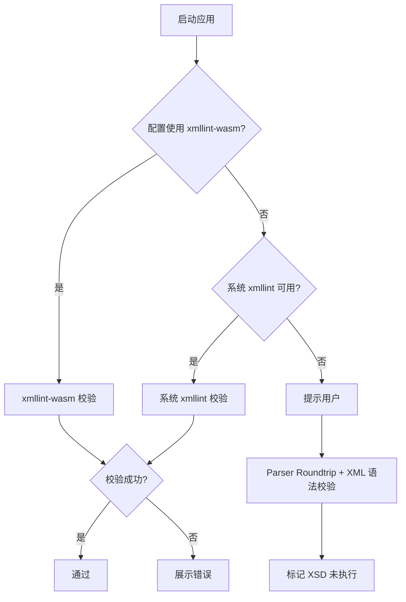

# xmllint 打包与降级策略调研

> 文档定位：SLD XSD 校验所依赖的 `xmllint` 工具在不同平台的可用性、打包方案与降级策略。  
> 配套设计：[sld-service.md](sld-service.md)

---

## 1. 目标

- 开发阶段能稳定调用系统 `xmllint` 对生成的 SLD 做 OGC XSD 校验。
- 打包后的 Electron 桌面应用在不依赖用户手动安装工具的前提下，也能完成 XSD 校验。
- 当 `xmllint` 不可用时，有清晰的降级路径，避免阻塞导出流程。

---

## 2. 平台可用性

| 平台 | xmllint 预装情况 | 获取方式 |
|---|---|---|
| macOS | 多数系统已预装，或通过 Xcode Command Line Tools 安装 | `/usr/bin/xmllint` |
| Linux | 通常可通过包管理器安装 `libxml2-utils` | `apt install libxml2-utils` / `yum install libxml2` |
| Windows | **不预装** | 需下载 libxml2 Windows binaries |

### Windows 二进制来源

1. **官方 xmlsoft.org 归档**
   - 32-bit: `http://xmlsoft.org/sources/win32/`
   - 64-bit: `http://xmlsoft.org/sources/win32/64bit/`
   - 下载 `libxml2`、配套 `iconv`、`zlib` 压缩包，解压 `bin/` 目录即可得到 `xmllint.exe` 及所需 DLL。

2. **PowerShell 自动安装脚本**
   - 参考：[Download and install xmllint for Windows](https://gist.github.com/mavaddat/f021e09f8c2d492e19959a9978b42544)
   - 自动检测 64/32 位，下载并解压到 `%LOCALAPPDATA%\Programs\xmllint`。

3. **Igor Zlatkovic 预编译包**
   - 参考：[https://www.zlatkovic.com/projects/libxml/](https://www.zlatkovic.com/projects/libxml/)
   - ROS 2 Windows 文档长期引用该来源。

---

## 3. 可选方案对比

### 方案 A：依赖系统 xmllint

| 项 | 说明 |
|---|---|
| 实现 | 启动时检测 `xmllint` 是否在 PATH，XSD 校验直接 `child_process.execFile` 调用。 |
| 优点 | 零额外依赖，开发最简。 |
| 缺点 | Windows 用户需手动安装；打包后分发体验差。 |
| 适用 | 开发阶段、内部工具、Linux/macOS 环境。 |

### 方案 B：打包时内嵌静态 xmllint 二进制

| 项 | 说明 |
|---|---|
| 实现 | Electron Builder 将 `xmllint`（Windows 为 `xmllint.exe` + DLL，macOS/Linux 为对应二进制）复制到 `resources/bin/`，启动时检测并使用。 |
| 优点 | 完全离线可用，体验一致。 |
| 缺点 | 增加打包体积（约 2–5 MB）；需为三个平台准备二进制；许可协议需确认（libxml2 为 MIT 许可，较宽松）。 |
| 适用 | 面向最终用户的桌面应用。 |

### 方案 C：使用 `xmllint-wasm`

| 项 | 说明 |
|---|---|
| 实现 | `npm install xmllint-wasm`，Node.js 中直接调用 WebAssembly 版 `xmllint`。 |
| 优点 | 纯 JS/WASM，无需平台二进制；Node.js 16+ 可用；跨平台一致。 |
| 缺点 | 首次加载有 WASM 编译开销；需手动预加载 XSD 及其依赖（`xsd:import`/`xsd:include`）。 |
| 适用 | 推荐作为打包后的主校验方案。 |

### 方案 D：使用 Node.js XML 校验库

| 项 | 说明 |
|---|---|
| 实现 | `libxmljs2`、`fast-xml-parser` 等库做 XSD 或语法校验。 |
| 优点 | 纯 Node 依赖，安装方便。 |
| 缺点 | `fast-xml-parser` 不支持完整 XSD；`libxmljs2` 需要原生编译，跨平台构建复杂。 |
| 适用 | 仅做语法校验或 fallback。 |

---

## 4. 推荐策略（分阶段）

### 阶段 1：MVP / 开发期

- **主校验**：系统 `xmllint`。
- **检测**：应用启动时调用 `xmllint --version`。
- **缺失提示**：Windows 未安装时，弹窗提示安装方法，并提供“跳过 XSD 校验”选项。
- **降级**：Parser Roundtrip 校验 + XML 语法校验（`fast-xml-parser`）。

### 阶段 2：打包发布

- **推荐主校验**：`xmllint-wasm`。
- **理由**：避免维护三套平台二进制，打包简单，离线可用。
- **实现要点**：
  - 将 `Document/Research/sld/1.0.0/StyledLayerDescriptor.xsd` **及其全部 `xsd:import/include` 依赖**预加载为字符串。
  - **已验证的 SLD 1.0.0 依赖清单**（下载后全部放在同一目录，使用 basename 作为 `schemaLocation`）：
    - `StyledLayerDescriptor.xsd`（主 schema，来自仓库副本）
    - `xlink.xsd`
    - `xml.xsd`
    - `filter.xsd`
    - `expr.xsd`
    - `geometry.xsd`
    - `gml.xsd`
    - `feature.xsd`
  - **bundle 生成脚本**：参考 `spike/xmllint-wasm-bundle/scripts/download-sld-schemas.js`，项目级脚本可放在 `scripts/download-sld-schemas.js`（或构建流程中调用）。脚本行为：
    1. 复制仓库内 `Document/Research/sld/1.0.0/StyledLayerDescriptor.xsd`。
    2. 从 `schemas.opengis.net` / `www.w3.org` 下载 7 个依赖到同一目录。
    3. 对所有 `.xsd` 中的 `schemaLocation` 按 basename 改写（例如 `http://schemas.opengis.net/gml/2.1.2/geometry.xsd` → `geometry.xsd`）。
    4. 输出目录可通过 `SLD_SCHEMA_DIR` 覆盖，默认 `schemas/`。
  - **bundle 体积与性能**（SP-04 实测）：
    - 8 个文件，共 **81.4 KB**。
    - 下载耗时约 **2.3s**（含网络）。
    - Node 校验耗时约 **65ms**。
    - Electron 主进程校验耗时约 **80–220ms**。
  - 校验时调用 `validateXML({ xml, schema: [mainXsd], preload: dependencyXsds })`。
  - 错误信息格式化后展示在 ValidationPanel。
- **Spike 验证**：
  - 仅传入单个 `StyledLayerDescriptor.xsd` 时，`xmllint-wasm` 无法编译 schema（缺少 xlink/filter 等依赖），必须提供完整 bundle。详见 [spike/parser-e2e/report.md](../../../spike/parser-e2e/report.md)。
  - SP-04 已确认：完整 bundle + `schemaLocation` 改写后，`xmllint-wasm` 在 Node 与 Electron（`ELECTRON_RUN_AS_NODE=1`）中均可正常校验。详见 [spike/xmllint-wasm-bundle/result.md](../../../spike/xmllint-wasm-bundle/result.md)。

### 阶段 3：高级需求

- 若对校验性能或原生能力有更高要求，再评估内嵌平台二进制（方案 B）。

---

## 5. `xmllint-wasm` 使用示例

```typescript
import { validateXML } from 'xmllint-wasm';
import { readdirSync, readFileSync } from 'node:fs';
import { resolve } from 'node:path';

const SCHEMA_DIR = resolve(__dirname, '../resources/sld-schemas');

function loadSchemaBundle() {
  const files = readdirSync(SCHEMA_DIR).filter(f => f.endsWith('.xsd'));
  const schemas = files.map(fileName => ({
    fileName,
    contents: readFileSync(resolve(SCHEMA_DIR, fileName), 'utf-8'),
  }));
  // 主 schema 放在第一位
  schemas.sort((a, b) =>
    a.fileName === 'StyledLayerDescriptor.xsd' ? -1
    : b.fileName === 'StyledLayerDescriptor.xsd' ? 1
    : 0
  );
  const [main, ...deps] = schemas;
  return { main, deps };
}

async function validateSld(xml: string): Promise<ValidationResult> {
  const start = Date.now();
  const { main, deps } = loadSchemaBundle();
  try {
    const result = await validateXML({
      xml: [{ fileName: 'style.sld', contents: xml }],
      schema: [main],
      preload: deps,
    });

    if (result.valid) {
      return { passed: true, durationMs: Date.now() - start, tool: 'xmllint-wasm' };
    }
    return {
      passed: false,
      durationMs: Date.now() - start,
      tool: 'xmllint-wasm',
      message: result.errors.map(e => e.message).join('\n'),
    };
  } catch (err: any) {
    return {
      passed: false,
      durationMs: Date.now() - start,
      tool: 'xmllint-wasm',
      message: err.message,
    };
  }
}
```

> **注意**：`preload` 中的 `fileName` 必须与 XSD 中 `schemaLocation` 使用的相对文件名一致；使用绝对 URL 作为 `fileName` 会导致 xmllint-wasm 虚拟文件系统报错。
>
> 因此下载完成后必须对所有 `schemaLocation="..."` 做 basename 改写：任何属于上述 8 个依赖的 URL 或相对路径都替换为本地文件名（如 `geometry.xsd`）。该改写由 bundle 生成脚本统一完成，不要手动修改 XSD。


---

## 6. 降级路径



---

## 7. 对 SldService 的影响

```typescript
interface SldServiceOptions {
  /** 本地 XSD 路径，开发期默认 Document/Research/sld/1.0.0/StyledLayerDescriptor.xsd */
  xsdPath?: string;
  /** 系统 xmllint 路径 */
  xmllintPath?: string;
  /** 强制使用 xmllint-wasm，无视系统工具 */
  useWasm?: boolean;
  /** xmllint-wasm schema bundle 目录；提供时优先使用 WASM 校验 */
  wasmSchemaBundleDir?: string;
  /** xmllint 不可用时是否跳过 XSD */
  skipXsdIfUnavailable?: boolean;
}
```

- `wasmSchemaBundleDir` 存在（或 `useWasm` 为 `true`）时，使用 `xmllint-wasm`。
- 否则检测系统 `xmllint`；缺失时根据 `skipXsdIfUnavailable` 决定是报错还是降级。

---

## 8. 待验证问题

- [x] SLD 1.0.0 XSD 是否依赖其他 XSD？**已确认**：依赖 `xlink.xsd`、`xml.xsd`、`filter.xsd`、`expr.xsd`、`geometry.xsd`、`gml.xsd`、`feature.xsd`，`xmllint-wasm` 必须一起 preload。
- [x] `xmllint-wasm` 在 Electron 主进程中的加载性能与 Worker 线程行为。**已验证**：以 `ELECTRON_RUN_AS_NODE=1` 执行 Node 脚本可正常加载 WASM；`example-sld.xml` 校验耗时 80–220ms。
- [x] `xmllint-wasm` 打包到 Electron 后的体积增量。**已估算**：schema bundle 仅 81.4 KB；`xmllint-wasm` 包体积按 npm 依赖计入。

---

## 9. 结论

| 场景 | 推荐方案 |
|---|---|
| 开发期 | 系统 xmllint（如已安装）或 `xmllint-wasm` |
| 生产打包 | **`xmllint-wasm` + 自动化 schema bundle 下载脚本** |
| 无 XSD 工具时的保底 | Parser Roundtrip + XML 语法校验 |

---

## 10. 参考资料

- [Download and install xmllint for Windows](https://gist.github.com/mavaddat/f021e09f8c2d492e19959a9978b42544)
- [Igor Zlatkovic libxml Windows binaries](https://www.zlatkovic.com/projects/libxml/)
- [ROS 2 Humble Windows Development Setup](https://docs.ros.org/en/humble/Installation/Alternatives/Windows-Development-Setup.html)
- [npm: xmllint-wasm](https://www.npmjs.com/package/xmllint-wasm)
- [GitHub: noppa/xmllint-wasm](https://github.com/noppa/xmllint-wasm)
- [GIS StackExchange: Validate StyledLayerDescriptor (SLD)](https://gis.stackexchange.com/questions/149571/validate-styledlayerdescriptor-sld)
